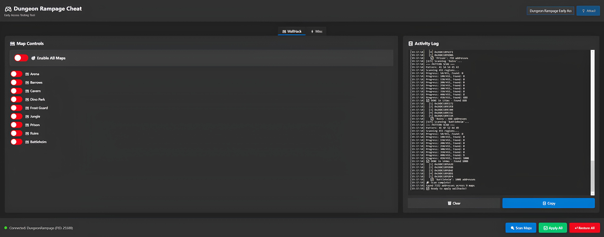

<div align="center">

# 🎮 Dungeon Rampage Cheat Tool

[](https://opensource.org/licenses/MIT)
[](https://dotnet.microsoft.com/)
[](https://www.microsoft.com/windows)
[](https://github.com/tonhowtf/DungeonRampageCheat/releases/latest)

**Real-time memory manipulation framework for Dungeon Rampage Early Access**

[📥 Download](https://github.com/tonhowtf/DungeonRampageCheat/releases/latest) • [📖 Documentation](#-table-of-contents) • [💬 Discord](#-contact)



</div>

---

## 🌍 Language / Idioma / Dil

- [🇺🇸 English](#-english-version)
- [🇧🇷 Português](#-versão-em-português)
- [🇹🇷 Türkçe](#-türkçe-sürüm)

---

# 🇺🇸 English Version

## 📋 Table of Contents

- [About](#-about)
- [Features](#-features)
- [Download & Installation](#-download--installation)
- [How to Use](#-how-to-use)
- [Build from Source](#-build-from-source)
- [Technologies](#-technologies)
- [Legal Disclaimer](#-legal-disclaimer)
- [Contact](#-contact)
- [License](#-license)

---

## 🎯 About

**Dungeon Rampage Cheat Tool** is a real-time memory manipulation framework developed for Dungeon Rampage Early Access testing. This project offers advanced features for quality testing and gameplay balancing through process injection, pattern scanning, and memory patching techniques.

### ✨ Highlights

- 🗺️ **WallHack** - Walk through walls on all maps
- 🚀 **Speed Hack** - Increase movement speed (Ranger only)
- 🔭 **Zoom Hack** - Adjust camera zoom
- 🎮 **Modern Interface** - Intuitive and responsive WPF UI
- 🔧 **Open Source** - 100% open and auditable code

---

## 🚀 Features

### 🗺️ WallHack (Walk Through Walls)

Allows passing through obstacles on all available maps:

- ✅ Arena
- ✅ Barrows (Catacombs)
- ✅ Cavern
- ✅ Dino Park
- ✅ Frost Guard
- ✅ Jungle
- ✅ Prison
- ✅ Ruins
- ✅ Battleheim

**How it works:**
1. Connect to game process
2. Scan loaded maps
3. Enable/disable individually or all at once
4. Restore when needed

### ⚡ Speed Hack (Ranger Only)

Increases overall movement speed for Ranger class:

- 🎯 **Pattern:** 16-byte memory signature
- ⚡ **Effect:** Faster movement and projectile speed
- 🔄 **Toggle:** Enable/Disable on demand
- 📊 **Real-time:** Instant activation

### 🔭 Zoom Hack (Camera)

Full control over camera zoom:

- 🎚️ **Slider** - Precise adjustment from 0.1 to 0.63
- 🎯 **Presets** - Quick values (0.1, 0.2, 0.3, 0.4, 0.5)
- 🔄 **Restore** - Return to default zoom (0.63)
- 📏 Lower values = more zoom out (wider view)

---

## 📥 Download & Installation

### Option 1: Binary Download (Recommended)

1. Go to [**Releases**](https://github.com/tonhowtf/DungeonRampageCheat/releases/latest)
2. Download latest version (`DungeonRampageCheat-v1.0.0-win-x64.zip`)
3. Extract ZIP file
4. Run `DungeonRampageCheat.exe`

**Requirements:**
- Windows 10/11 (64-bit)
- .NET 8.0 Runtime (included in executable)
- Dungeon Rampage Early Access installed

### Option 2: Build from Source

See [Build from Source](#-build-from-source) section

---

## 🎮 How to Use

### Step 1: Start the Game
```
1. Open Dungeon Rampage Early Access
2. Enter a map/dungeon
```

### Step 2: Connect to Process
```
1. Open DungeonRampageCheat.exe
2. Enter process name (default: "Dungeon Rampage Early Access")
3. Click "🔌 Attach"
4. Wait for connection confirmation
```

### Step 3: WallHack
```
1. Click "🔍 Scan Maps"
2. Wait for complete scan
3. Enable desired maps individually
   OR
4. Use "✅ Apply All" to enable all
```

### Step 4: Speed Hack (Ranger Only)
```
1. Play as Ranger class
2. Go to "⚡ Misc" tab
3. Click "🔍 Scan Speed"
4. Click "▶️ Enable Speed"
5. Toggle on/off as needed
```

### Step 5: Zoom Hack
```
1. Make sure you're in-game (not menu)
2. Go to "⚡ Misc" tab
3. Click "🔍 Scan Zoom"
4. Use slider or presets to adjust
5. Click "↩️ Restore" to return to normal
```

---

## 🛠️ Build from Source

### Prerequisites

- [Visual Studio 2022](https://visualstudio.microsoft.com/) or higher
- [.NET 8.0 SDK](https://dotnet.microsoft.com/download/dotnet/8.0)
- Windows 10/11

### Step by Step

#### 1. Clone Repository
```bash
git clone https://github.com/tonhowtf/DungeonRampageCheat.git
cd DungeonRampageCheat
```

#### 2. Restore Dependencies
```bash
dotnet restore
```

#### 3. Build for Debug
```bash
dotnet build -c Debug
```

#### 4. Build for Release (Single File)
```bash
dotnet publish -c Release -r win-x64 --self-contained true -p:PublishSingleFile=true -p:IncludeNativeLibrariesForSelfExtract=true
```

Executable will be at:
```
bin/Release/net8.0-windows/win-x64/publish/DungeonRampageCheat.exe
```

---

## 💻 Technologies

### Core
- **C# 12** - Programming language
- **.NET 8.0** - Framework
- **WPF** - Graphical interface

### Libraries
- **PInvoke.Kernel32** - Windows API access
- **PInvoke.User32** - Window manipulation
- **ModernWpf** - Modern UI

### Techniques
- Memory scanning (pattern search)
- Process injection
- Memory patching
- Real-time memory manipulation

---

## ⚖️ Legal Disclaimer

⚠️ **IMPORTANT: READ CAREFULLY**

This tool was developed **EXCLUSIVELY** for educational purposes and testing during Dungeon Rampage Early Access phase.

### ❌ Prohibitions

- ❌ **DO NOT use on public/official servers**
- ❌ **DO NOT use to cheat against other players**
- ❌ **DO NOT distribute modified versions without credits**
- ❌ **DO NOT use for unfair competitive advantage**

### ✅ Permitted Use

- ✅ Internal testing in controlled environment
- ✅ Reverse engineering learning
- ✅ Code development and study

### 📜 Disclaimer
```
This software is provided "as is", without warranties of any kind.
The author is not responsible for:
- Account bans
- Game or system damage
- ToS (Terms of Service) violations
- Legal consequences of misuse

BY USING THIS TOOL, YOU AGREE TO:
- Take full responsibility for your actions
- Use only in authorized testing environments
- Respect game developers' rights
- Not harm other players' experience
```

---

## 📞 Contact

### Discord
**tonhowtf**

Contact for:
- 🐛 Report bugs
- 💡 Suggest features
- 🤝 Collaborate on project
- ❓ Ask questions

### GitHub
- 🌟 [Leave a Star](https://github.com/tonhowtf/DungeonRampageCheat)
- 🐛 [Open an Issue](https://github.com/tonhowtf/DungeonRampageCheat/issues)
- 🔀 [Fork](https://github.com/tonhowtf/DungeonRampageCheat/fork)

---

## 📄 License

This project is licensed under the **MIT License** - see [LICENSE](LICENSE) file for details.

---

## 🌟 Acknowledgments

- Dungeon Rampage Community
- Project Contributors
- Testers who reported bugs

---

## 📊 Project Status
```
✅ WallHack - Functional
✅ Speed Hack (Ranger) - Functional
✅ Zoom Hack - Functional
⏳ Ultimate Hack - In Development
```

---

# 🇧🇷 Versão em Português

## 📋 Índice

- [Sobre](#-sobre-1)
- [Funcionalidades](#-funcionalidades-1)
- [Download e Instalação](#-download-e-instalação-1)
- [Como Usar](#-como-usar-1)
- [Compilar do Código Fonte](#-compilar-do-código-fonte-1)
- [Tecnologias](#-tecnologias-1)
- [Aviso Legal](#-aviso-legal-1)
- [Contato](#-contato-1)
- [Licença](#-licença-1)

---

## 🎯 Sobre

**Dungeon Rampage Cheat Tool** é um framework de manipulação de memória em tempo real desenvolvido para testes do Dungeon Rampage Early Access. Este projeto oferece recursos avançados para testes de qualidade e balanceamento de gameplay através de técnicas de injeção de processo, escaneamento de padrões e modificação de memória.

### ✨ Destaques

- 🗺️ **WallHack** - Atravesse paredes em todos os mapas
- 🚀 **Speed Hack** - Aumente a velocidade de movimento (Somente Ranger)
- 🔭 **Zoom Hack** - Ajuste o zoom da câmera
- 🎮 **Interface Moderna** - UI WPF intuitiva e responsiva
- 🔧 **Open Source** - Código 100% aberto e auditável

---

## 🚀 Funcionalidades

### 🗺️ WallHack (Atravessar Paredes)

Permite passar através de obstáculos em todos os mapas disponíveis:

- ✅ Arena
- ✅ Barrows (Catacumbas)
- ✅ Cavern (Caverna)
- ✅ Dino Park (Parque dos Dinossauros)
- ✅ Frost Guard (Guarda Gélida)
- ✅ Jungle (Selva)
- ✅ Prison (Prisão)
- ✅ Ruins (Ruínas)
- ✅ Battleheim (Campo de Batalha)

**Como funciona:**
1. Conecte-se ao processo do jogo
2. Escaneie os mapas carregados
3. Ative/desative individualmente ou todos de uma vez
4. Restaure quando necessário

### ⚡ Speed Hack (Somente Ranger)

Aumenta a velocidade de movimento geral da classe Ranger:

- 🎯 **Padrão:** Assinatura de memória de 16 bytes
- ⚡ **Efeito:** Movimento e projéteis mais rápidos
- 🔄 **Alternância:** Ativar/Desativar sob demanda
- 📊 **Tempo real:** Ativação instantânea

### 🔭 Zoom Hack (Câmera)

Controle total sobre o zoom da câmera:

- 🎚️ **Slider** - Ajuste preciso de 0.1 a 0.63
- 🎯 **Presets** - Valores rápidos (0.1, 0.2, 0.3, 0.4, 0.5)
- 🔄 **Restore** - Volte ao zoom padrão (0.63)
- 📏 Valores menores = mais zoom out (visão ampliada)

---

## 📥 Download e Instalação

### Opção 1: Download Binário (Recomendado)

1. Acesse a página de [**Releases**](https://github.com/tonhowtf/DungeonRampageCheat/releases/latest)
2. Baixe a versão mais recente (`DungeonRampageCheat-v1.0.0-win-x64.zip`)
3. Extraia o arquivo ZIP
4. Execute `DungeonRampageCheat.exe`

**Requisitos:**
- Windows 10/11 (64-bit)
- .NET 8.0 Runtime (incluído no executável)
- Dungeon Rampage Early Access instalado

### Opção 2: Compilar do Código Fonte

Veja a seção [Compilar do Código Fonte](#-compilar-do-código-fonte-1)

---

## 🎮 Como Usar

### Passo 1: Iniciar o Jogo
```
1. Abra Dungeon Rampage Early Access
2. Entre em um mapa/dungeon
```

### Passo 2: Conectar ao Processo
```
1. Abra DungeonRampageCheat.exe
2. Digite o nome do processo (padrão: "Dungeon Rampage Early Access")
3. Clique em "🔌 Attach"
4. Aguarde a confirmação de conexão
```

### Passo 3: WallHack
```
1. Clique em "🔍 Scan Maps"
2. Aguarde a varredura completa
3. Ative os mapas desejados individualmente
   OU
4. Use "✅ Apply All" para ativar todos
```

### Passo 4: Speed Hack (Somente Ranger)
```
1. Entre no jogo com classe Ranger
2. Na aba "⚡ Misc"
3. Clique em "🔍 Scan Speed"
4. Clique em "▶️ Enable Speed"
5. Alterne ligado/desligado conforme necessário
```

### Passo 5: Zoom Hack
```
1. Certifique-se de estar no jogo (não no menu)
2. Na aba "⚡ Misc"
3. Clique em "🔍 Scan Zoom"
4. Use o slider ou presets para ajustar
5. Clique em "↩️ Restore" para voltar ao normal
```

---

## 🛠️ Compilar do Código Fonte

### Pré-requisitos

- [Visual Studio 2022](https://visualstudio.microsoft.com/) ou superior
- [.NET 8.0 SDK](https://dotnet.microsoft.com/download/dotnet/8.0)
- Windows 10/11

### Passo a Passo

#### 1. Clonar o Repositório
```bash
git clone https://github.com/tonhowtf/DungeonRampageCheat.git
cd DungeonRampageCheat
```

#### 2. Restaurar Dependências
```bash
dotnet restore
```

#### 3. Compilar para Debug
```bash
dotnet build -c Debug
```

#### 4. Compilar para Release (Arquivo Único)
```bash
dotnet publish -c Release -r win-x64 --self-contained true -p:PublishSingleFile=true -p:IncludeNativeLibrariesForSelfExtract=true
```

O executável estará em:
```
bin/Release/net8.0-windows/win-x64/publish/DungeonRampageCheat.exe
```

---

## 💻 Tecnologias

### Core
- **C# 12** - Linguagem de programação
- **.NET 8.0** - Framework
- **WPF** - Interface gráfica

### Bibliotecas
- **PInvoke.Kernel32** - Acesso a APIs do Windows
- **PInvoke.User32** - Manipulação de janelas
- **ModernWpf** - UI moderna

### Técnicas
- Memory scanning (busca de padrões)
- Process injection
- Memory patching
- Real-time memory manipulation

---

## ⚖️ Aviso Legal

⚠️ **IMPORTANTE: LEIA COM ATENÇÃO**

Esta ferramenta foi desenvolvida **EXCLUSIVAMENTE** para fins educacionais e de teste durante a fase Early Access do jogo Dungeon Rampage.

### ❌ Proibições

- ❌ **NÃO use em servidores públicos/oficiais**
- ❌ **NÃO use para trapacear contra outros jogadores**
- ❌ **NÃO distribua versões modificadas sem créditos**
- ❌ **NÃO use para vantagem competitiva injusta**

### ✅ Uso Permitido

- ✅ Testes internos em ambiente controlado
- ✅ Aprendizado de engenharia reversa
- ✅ Desenvolvimento e estudo de código

### 📜 Disclaimer
```
Este software é fornecido "como está", sem garantias de qualquer tipo.
O autor não se responsabiliza por:
- Banimentos de conta
- Danos ao jogo ou sistema
- Violações de ToS (Terms of Service)
- Consequências legais do uso indevido

AO USAR ESTA FERRAMENTA, VOCÊ CONCORDA EM:
- Assumir total responsabilidade por suas ações
- Usar apenas em ambientes de teste autorizados
- Respeitar os direitos dos desenvolvedores do jogo
- Não prejudicar a experiência de outros jogadores
```

---

## 📞 Contato

### Discord
**tonhowtf**

Entre em contato para:
- 🐛 Reportar bugs
- 💡 Sugerir features
- 🤝 Colaborar no projeto
- ❓ Tirar dúvidas

### GitHub
- 🌟 [Deixe uma Star](https://github.com/tonhowtf/DungeonRampageCheat)
- 🐛 [Abra uma Issue](https://github.com/tonhowtf/DungeonRampageCheat/issues)
- 🔀 [Faça um Fork](https://github.com/tonhowtf/DungeonRampageCheat/fork)

---

## 📄 Licença

Este projeto está licenciado sob a **MIT License** - veja o arquivo [LICENSE](LICENSE) para detalhes.

---

## 🌟 Agradecimentos

- Comunidade de Dungeon Rampage
- Contribuidores do projeto
- Testadores que reportaram bugs

---

## 📊 Status do Projeto
```
✅ WallHack - Funcional
✅ Speed Hack (Ranger) - Funcional
✅ Zoom Hack - Funcional
⏳ Ultimate Hack - Em Desenvolvimento
```

---

# 🇹🇷 Türkçe Sürüm

## 📋 İçindekiler

- [Hakkında](#-hakkında)
- [Özellikler](#-özellikler)
- [İndirme ve Kurulum](#-i̇ndirme-ve-kurulum)
- [Nasıl Kullanılır](#-nasıl-kullanılır)
- [Kaynak Koddan Derleme](#-kaynak-koddan-derleme)
- [Teknolojiler](#-teknolojiler)
- [Yasal Uyarı](#-yasal-uyarı)
- [İletişim](#-i̇letişim)
- [Lisans](#-lisans)

---

## 🎯 Hakkında

**Dungeon Rampage Cheat Tool**, Dungeon Rampage Early Access testleri için geliştirilmiş gerçek zamanlı bellek manipülasyon çerçevesidir. Bu proje, process injection, pattern scanning ve memory patching teknikleri ile kalite testi ve oyun dengeleme için gelişmiş özellikler sunar.

### ✨ Öne Çıkanlar

- 🗺️ **WallHack** - Tüm haritalarda duvarlardan geçin
- 🚀 **Speed Hack** - Hareket hızını artırın (Sadece Ranger)
- 🔭 **Zoom Hack** - Kamera yakınlaştırmasını ayarlayın
- 🎮 **Modern Arayüz** - Sezgisel ve duyarlı WPF kullanıcı arayüzü
- 🔧 **Açık Kaynak** - %100 açık ve denetlenebilir kod

---

## 🚀 Özellikler

### 🗺️ WallHack (Duvarlardan Geçme)

Tüm mevcut haritalarda engellerden geçmeye izin verir:

- ✅ Arena (Arena)
- ✅ Barrows (Mezarlık)
- ✅ Cavern (Mağara)
- ✅ Dino Park (Dinozor Parkı)
- ✅ Frost Guard (Buz Muhafızı)
- ✅ Jungle (Orman)
- ✅ Prison (Hapishane)
- ✅ Ruins (Harabeler)
- ✅ Battleheim (Savaş Alanı)

**Nasıl çalışır:**
1. Oyun sürecine bağlanın
2. Yüklenmiş haritaları tarayın
3. Tek tek veya hepsini birden etkinleştirin/devre dışı bırakın
4. Gerektiğinde geri yükleyin

### ⚡ Speed Hack (Sadece Ranger)

Ranger sınıfı için genel hareket hızını artırır:

- 🎯 **Desen:** 16 baytlık bellek imzası
- ⚡ **Etki:** Daha hızlı hareket ve mermi hızı
- 🔄 **Geçiş:** İsteğe bağlı Etkinleştir/Devre Dışı Bırak
- 📊 **Gerçek zamanlı:** Anında aktivasyon

### 🔭 Zoom Hack (Kamera)

Kamera yakınlaştırması üzerinde tam kontrol:

- 🎚️ **Kaydırıcı** - 0.1'den 0.63'e hassas ayar
- 🎯 **Ön Ayarlar** - Hızlı değerler (0.1, 0.2, 0.3, 0.4, 0.5)
- 🔄 **Geri Yükle** - Varsayılan yakınlaştırmaya dön (0.63)
- 📏 Düşük değerler = daha fazla uzaklaştırma (geniş görüş)

---

## 📥 İndirme ve Kurulum

### Seçenek 1: İkili Dosya İndirme (Önerilen)

1. [**Releases**](https://github.com/tonhowtf/DungeonRampageCheat/releases/latest) sayfasına gidin
2. En son sürümü indirin (`DungeonRampageCheat-v1.0.0-win-x64.zip`)
3. ZIP dosyasını çıkarın
4. `DungeonRampageCheat.exe` dosyasını çalıştırın

**Gereksinimler:**
- Windows 10/11 (64-bit)
- .NET 8.0 Runtime (yürütülebilir dosyada dahil)
- Dungeon Rampage Early Access yüklü

### Seçenek 2: Kaynak Koddan Derleme

[Kaynak Koddan Derleme](#-kaynak-koddan-derleme) bölümüne bakın

---

## 🎮 Nasıl Kullanılır

### Adım 1: Oyunu Başlatın
```
1. Dungeon Rampage Early Access'i açın
2. Bir harita/zindan'a girin
```

### Adım 2: Sürece Bağlanın
```
1. DungeonRampageCheat.exe'yi açın
2. İşlem adını girin (varsayılan: "Dungeon Rampage Early Access")
3. "🔌 Attach" düğmesine tıklayın
4. Bağlantı onayını bekleyin
```

### Adım 3: WallHack
```
1. "🔍 Scan Maps" düğmesine tıklayın
2. Tam taramayı bekleyin
3. İstediğiniz haritaları tek tek etkinleştirin
   VEYA
4. Tümünü etkinleştirmek için "✅ Apply All" kullanın
```

### Adım 4: Speed Hack (Sadece Ranger)
```
1. Ranger sınıfıyla oynayın
2. "⚡ Misc" sekmesine gidin
3. "🔍 Scan Speed" düğmesine tıklayın
4. "▶️ Enable Speed" düğmesine tıklayın
5. Gerektiğinde açıp kapatın
```

### Adım 5: Zoom Hack
```
1. Oyunda olduğunuzdan emin olun (menüde değil)
2. "⚡ Misc" sekmesine gidin
3. "🔍 Scan Zoom" düğmesine tıklayın
4. Ayarlamak için kaydırıcı veya ön ayarları kullanın
5. Normale dönmek için "↩️ Restore" düğmesine tıklayın
```

---

## 🛠️ Kaynak Koddan Derleme

### Ön Koşullar

- [Visual Studio 2022](https://visualstudio.microsoft.com/) veya üzeri
- [.NET 8.0 SDK](https://dotnet.microsoft.com/download/dotnet/8.0)
- Windows 10/11

### Adım Adım

#### 1. Depoyu Klonlayın
```bash
git clone https://github.com/tonhowtf/DungeonRampageCheat.git
cd DungeonRampageCheat
```

#### 2. Bağımlılıkları Geri Yükleyin
```bash
dotnet restore
```

#### 3. Debug İçin Derleyin
```bash
dotnet build -c Debug
```

#### 4. Release İçin Derleyin (Tek Dosya)
```bash
dotnet publish -c Release -r win-x64 --self-contained true -p:PublishSingleFile=true -p:IncludeNativeLibrariesForSelfExtract=true
```

Yürütülebilir dosya şurada olacak:
```
bin/Release/net8.0-windows/win-x64/publish/DungeonRampageCheat.exe
```

---

## 💻 Teknolojiler

### Çekirdek
- **C# 12** - Programlama dili
- **.NET 8.0** - Framework
- **WPF** - Grafik arayüzü

### Kütüphaneler
- **PInvoke.Kernel32** - Windows API erişimi
- **PInvoke.User32** - Pencere manipülasyonu
- **ModernWpf** - Modern kullanıcı arayüzü

### Teknikler
- Bellek tarama (desen arama)
- İşlem enjeksiyonu
- Bellek yamalama
- Gerçek zamanlı bellek manipülasyonu

---

## ⚖️ Yasal Uyarı

⚠️ **ÖNEMLİ: DİKKATLİCE OKUYUN**

Bu araç **YALNIZCA** Dungeon Rampage Early Access aşamasında eğitim amaçlı ve test için geliştirilmiştir.

### ❌ Yasaklar

- ❌ **Halka açık/resmi sunucularda KULLANMAYIN**
- ❌ **Diğer oyunculara karşı hile yapmak için KULLANMAYIN**
- ❌ **Kredi vermeden değiştirilmiş sürümleri DAĞITMAYIN**
- ❌ **Haksız rekabet avantajı için KULLANMAYIN**

### ✅ İzin Verilen Kullanım

- ✅ Kontrollü ortamda dahili testler
- ✅ Tersine mühendislik öğrenimi
- ✅ Kod geliştirme ve çalışma

### 📜 Feragatname
```
Bu yazılım "olduğu gibi" sağlanır, herhangi bir garanti olmaksızın.
Yazar şunlardan sorumlu değildir:
- Hesap yasaklamaları
- Oyun veya sistem hasarı
- ToS (Hizmet Şartları) ihlalleri
- Kötüye kullanımın yasal sonuçları

BU ARACI KULLANARAK, ŞUNLARDAKİ KABUL EDERSİNİZ:
- Eylemlerinizin tüm sorumluluğunu üstlenin
- Yalnızca yetkili test ortamlarında kullanın
- Oyun geliştiricilerinin haklarına saygı gösterin
- Diğer oyuncuların deneyimine zarar vermeyin
```

---

## 📞 İletişim

### Discord
**tonhowtf**

İletişim için:
- 🐛 Hata bildirin
- 💡 Özellik önerin
- 🤝 Projede işbirliği yapın
- ❓ Soru sorun

### GitHub
- 🌟 [Yıldız Bırakın](https://github.com/tonhowtf/DungeonRampageCheat)
- 🐛 [Issue Açın](https://github.com/tonhowtf/DungeonRampageCheat/issues)
- 🔀 [Fork Yapın](https://github.com/tonhowtf/DungeonRampageCheat/fork)

---

## 📄 Lisans

Bu proje **MIT Lisansı** altında lisanslanmıştır - ayrıntılar için [LICENSE](LICENSE) dosyasına bakın.

---

## 🌟 Teşekkürler

- Dungeon Rampage Topluluğu
- Proje Katkıda Bulunanlar
- Hata bildiren Test Uzmanları

---

## 📊 Proje Durumu
```
✅ WallHack - Çalışıyor
✅ Speed Hack (Ranger) - Çalışıyor
✅ Zoom Hack - Çalışıyor
⏳ Ultimate Hack - Geliştiriliyor
```

---

<div align="center">

**Made with ❤️ by [tonhowtf](https://github.com/tonhowtf)**

**❤️ ile yapıldı [tonhowtf](https://github.com/tonhowtf)**

**[tonhowtf](https://github.com/tonhowtf) tarafından ❤️ ile yapıldı**

If this project helped you, consider leaving a ⭐!

Se este projeto te ajudou, considere deixar uma ⭐!

Bu proje size yardımcı olduysa, bir ⭐ bırakmayı düşünün!

</div>